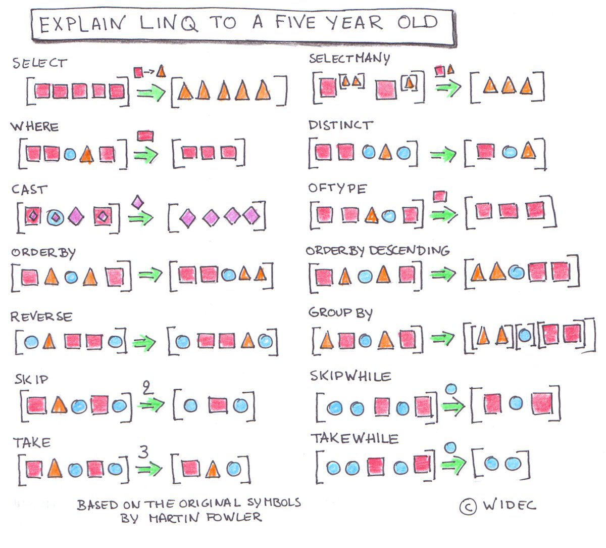

# C&#35;

## DistinctBy Extension Method

The following code shows an extension method for `IEnumerable<T>` makes a collection distinct by a certain value.

```C#
public static IEnumerable<TSource> DistinctBy<TSource, TResult>(this  IEnumerable<TSource> enumerable, Func<TSource, TResult> selector)
{
    if (enumerable == null)
    {
        throw new  ArgumentNullException(nameof(enumerable));
    }
    if (selector == null)
    {
        throw new  ArgumentNullException(nameof(selector));
    }

    HashSet<TResult> set = new HashSet<TResult>();
    foreach (TSource item in enumerable)
    {
        TResult value = selector(item);
        if (set.Add(value))
        {
            yield return item;
        }
    }
}
```

## LINQ Visualization


*[Image source](https://twitter.com/bewidec/status/935573858136051713)*

## Uninstall Program by Name

```C#
/// <summary>
/// Uninstalls the specified product.
/// </summary>
public static void UninstallProduct(string productName)
{
	ProcessStartInfo uninstallProcessStart = new ProcessStartInfo
	{
		FileName = "msiexec",
		Arguments = $"/x {GetProductCode(productName)} /quiet"
	};
	Process uninstallProcess = Process.Start(uninstallProcessStart);
	uninstallProcess?.WaitForExit();
}

/// <summary>
/// Returns the product code of the specified product, or null if it is not installed.
/// </summary>
public static string GetProductCode(string productName)
{
	foreach (RegistryKey registryKey in EnumerateInstalledProducts())
	{
		if (registryKey.GetValue("DisplayName")?.ToString() == productName)
		{
			return registryKey.Name.Split('\\')?.LastOrDefault();
		}
	}
	return null;
}

/// <summary>
/// Enumerates the <see cref="RegistryKey"/> objects for all the installed products.
/// </summary>
public static IEnumerable<RegistryKey> EnumerateInstalledProducts()
{
	using (RegistryKey key = Registry.LocalMachine.OpenSubKey(@"SOFTWARE\Microsoft\Windows\CurrentVersion\Uninstall"))
	{
		if (key != null)
		{
			foreach (string subKeyName in key.GetSubKeyNames())
			{
				using (RegistryKey subKey = key.OpenSubKey(subKeyName))
				{
					if (subKey != null)
					{
						yield return subKey;
					}
				}
			}
		}
	}
	using (RegistryKey key = Registry.LocalMachine.OpenSubKey(@"SOFTWARE\WOW6432Node\Microsoft\Windows\CurrentVersion\Uninstall"))
	{
		if (key != null)
		{
			foreach (string subKeyName in key.GetSubKeyNames())
			{
				using (RegistryKey subKey = key.OpenSubKey(subKeyName))
				{
					if (subKey != null)
					{
						yield return subKey;
					}
				}
			}
		}
	}
}
```
